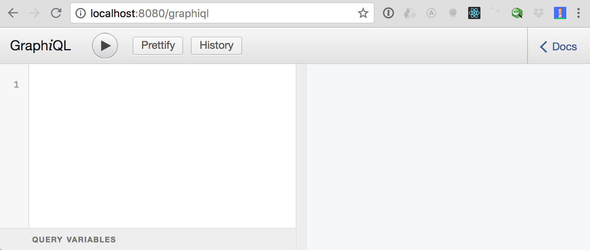

# OK GROW! Training

Welcome! These instructions apply to both _Practical GraphQL with React_ and _Practical Server-Side GraphQL_. In order to make the best use of peoples' time, we ask you to **please take the time to set a few things up before the class**.

## Setup Success looks like this

All students need the api dev server working. If the api server is set up correctly, you will be able to see the following at [localhost:8080/graphiql](http://localhost:8080/graphiql):



Detailed instructions can be found [here](#API-server-setup)

Students in Practical GraphQL with React will also need to get the UI dev server working. If it is set up properly, you will see the following at [localhost:3000](http://localhost:3000/). If you click "explore," you will see 2 locations and be able to view them on a map.


Detailed instructions can be found [here](#UI-server-setup)

## About the Class

### Versioning

We’ll use [Git](https://git-scm.com/book/en/v2/Getting-Started-Installing-Git) to complete exercises.

### Code editor

We recommend [VS Code](https://code.visualstudio.com/) with the following packages installed:

- ESLint
- One of:
  - GraphQL for VSCode (or)
  - GraphQL (newer)
- Prettier - Code formatter

If you prefer to use another editor, please check for corresponding packages.

### Node.js

You’ll need Node.js installed. We recommend the use of [NVM](https://nvm.sh). You can also install it from the [official website](https://nodejs.org). We’ll use Node 8 (LTS).

Though Node comes with a package manager called npm, we’ll use [Yarn](https://yarnpkg.com), a modern deterministic packager.

## Prerequisite knowledge

We will explore all of this thoroughly during the course, but if you are not comfortable with the following concepts, these links are worth a look.

### JavaScript basics

We won’t cover basic JS syntax. You should know at least how to write a function. If you don’t, please take this free course on [Codecademy](https://www.codecademy.com).

### ES2015+

Recent tools are making good use of the newest features in ES2015 and even ES2016 and ES2017. The newest JavaScript is a joy to use. If you haven't tried these, we hope you'll enjoy getting to know the new JS: http://es6-features.org/

Used in this class

- modules with import/export
- const and let
- arrow functions
- destructuring, rest and spread operators
- template literals (everywhere, but a special use in GraphQL)
- async/await - APIs and Apollo
- Array.concat()

### React

We will be using [React](https://facebook.github.io/react/) to render client components.

One nice thing about React is that it is close to base JS, so you should be able to follow even if you are new to it. Nevertheless, some understanding of it will be highly useful. We will implement the GraphQL integration with [render props](https://reactjs.org/docs/render-props.html). We'll help you if this is new to you.

### Nice to have - GraphQL culture

Some background on GraphQL: “[So what’s this GraphQL thing I keep hearing about?](https://medium.freecodecamp.com/so-whats-this-graphql-thing-i-keep-hearing-about-baf4d36c20cf)”

We will be using [Apollo](https://www.apollographql.com/docs/) for client and server GraphQL operations. You can get a head start by reviewing the documentation, but we will cover everything you need to know during the class.

## Questions before the course starts

Depending on your current level, you can expect to spend up to several hours on this material. It's worth it, and you will get much more from the class. If anything here is confusing or you want to clarify a fine point, please get in touch. We are happy to answer your questions, before, during, and after the class.

Ping us on Twitter:

- Robert Dickert - [@rdickert](https://twitter.com/rdickert)
- Paul Dowman - [@pauldowman](https://twitter.com/pauldowman)

Or email us at [training@okgrow.com](mailto:training@okgrow.com)

## Code Quality

We strive to use best practices in this repo, but we prioritize the learning experience where necessary.

This usually just means a simplified file structure, but this app lacks some safety and security features, so please use your judgment when reusing this code.

If you have any questions or concerns about specific code, please ask us; we love to talk about code quality.

## Detailed setup instructions

NOTE: If you are taking both classes, you'll be able to copy your .env files between the repos – the codebases are compatible (just make sure you match `api` and `ui` versions to the right folders).

### API server setup

```sh
# make a .env file from the example
cp .env.example .env
```

Update the .env file with your api keys:

- GOOGLE_API_KEY - use the same value as REACT_APP_GOOGLE_API_KEY in the ui folder: [Google Maps API](https://developers.google.com/maps/documentation/javascript/get-api-key)
- [DARKSKY_API_KEY](https://darksky.net/dev)

```sh
# install the dependencies
yarn

# run the API server
yarn start
```

#### Reset the database

This is not required for setup, but if you end up with a lot of `place`s while developing or your data gets corrupted, you can reset the db to the default setup with:

```sh
yarn reset-db
```

### UI server setup

> This project was bootstrapped with [Create React App](https://github.com/facebookincubator/create-react-app).

```sh
# make a .env file from the example
cp .env.example .env
```

Update the .env file with your api keys:

- REACT_APP_GOOGLE_API_KEY: use the same value as GOOGLE_API_KEY in the api folder [Google Maps API](https://developers.google.com/maps/documentation/javascript/get-api-key)

```sh
# install the dependencies
yarn

# run the web server
yarn start
```
